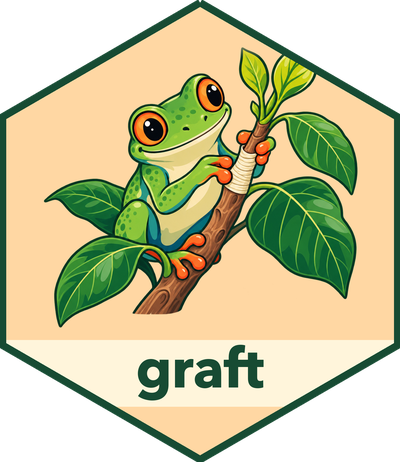

# graft 

**Give your R apps and agents project memory.** Keep useful findings, agreed
definitions, and reviewed decisions together with the evidence behind them, so a
later conversation or workflow can use them again.

Suppose you're building an analytics assistant with **ellmer and shinychat**.
Your team agrees that an “active customer” has a paid account and used the product
in the last 30 days. With Graft, your app can save that definition and its source,
record your review, and let a fresh chat look it up. When the team changes the
window to 60 days, you can review the correction while preserving the earlier
version and its evidence.

The model answers questions. Your application chooses what to retain and who may
use it. Graft keeps the knowledge and its history available across sessions.

## Try a project assistant

The package includes a small Shiny app with a project notebook beside the chat.
It starts in a **scripted preview** that exercises real Graft storage without
calling a model.

```r
pak::pak(c("JamesHWade/graft", "ellmer", "shinychat", "shiny", "bslib"))

# Keep the notebook in your project, including after the app stops.
Sys.setenv(GRAFT_DEMO_STORE = file.path(getwd(), "project-memory"))
shiny::runApp(system.file("examples", "project-memory", package = "graft"))
```

1. Read the proposed definition and source, then **Review and save**.
2. Ask **“How do we count an active customer?”**
3. Start a **New conversation** and ask again. The saved knowledge is still there.
4. Change the definition and source to use **60 days**, review the correction,
   and ask again. The next conversation retrieves the updated definition.
5. Stop and restart the app with the same store path to reopen the notebook.

For a live ellmer agent, configure `OPENAI_API_KEY`, set
`Sys.setenv(GRAFT_DEMO_LIVE = "true")`, and relaunch. The agent gets a read-only
memory tool; the notebook's review controls decide what it may remember.
Live mode sends prompts and retrieved memory to the configured model provider.

[**Build this step by step →**](https://jameshwade.github.io/graft/articles/getting-started.html)
The guide shows the Graft calls, the ellmer tool, and the shinychat connection.
The [complete example source](inst/examples/project-memory/) is included for you
to copy and adapt.

## Where you could use it

| Your project | Knowledge worth keeping | What a later task can recover |
|---|---|---|
| A project chat assistant | Reviewed metric definitions and team decisions | The current definition and the exact source it was based on |
| An analysis or research workflow | A conclusion, report, table, or figure with its inputs | The original output and its retained dependencies |
| Several agents working on the same domain | Shared concepts and field meanings bound to a data-dict release | The same vocabulary, even after the original dictionary changes |

You choose the payload: plain text, JSON, a rendered report, or other bytes.
Declare the evidence dependencies when you save it. Graft preserves exact
revisions, groups related artifacts into selections, and records acceptance or
withdrawal for a stated purpose. Reading a current accepted selection checks both
its recorded decision and its stored contents.

This lets you answer two different questions: **“What should this task use
now?”** and **“What did we use when we reached that earlier conclusion?”**

## Apply it to your app

Start with one kind of knowledge your users repeatedly need. For example, add a
“Save to project memory” action to an existing assistant, then expose a tool that
retrieves the latest reviewed note with its source. Your app supplies the project
or user scope, review action, and current access check. ellmer manages the model
and tools; shinychat presents the conversation.

As your notebook grows, your application can keep a catalog or search index to
choose relevant notes, then use Graft to verify the exact retained selection.
For shared terminology, [publish a vocabulary](https://jameshwade.github.io/graft/articles/shared-vocabulary.html)
bound to a data-dict dictionary.

## Further reading and current scope

- [Getting started: give a chat agent project memory](https://jameshwade.github.io/graft/articles/getting-started.html)
- [Artifacts, evidence, and review history](https://jameshwade.github.io/graft/articles/persistent-artifacts.html)
- [Shared concepts and vocabulary](https://jameshwade.github.io/graft/articles/shared-vocabulary.html)
- [Back up and restore a notebook](https://jameshwade.github.io/graft/articles/artifact-backups.html)
- [Architecture and integration requirements](https://jameshwade.github.io/graft/articles/compatibility.html)

Graft is pre-production. Local stores support trusted files and one writer;
PostgreSQL scopes work inside transactions owned by your application. The demo
is for one trusted local user. Shared deployment requires application-owned
identity, access, and retention controls. Permanent Forget and recovery from
retired backups remain active work.
