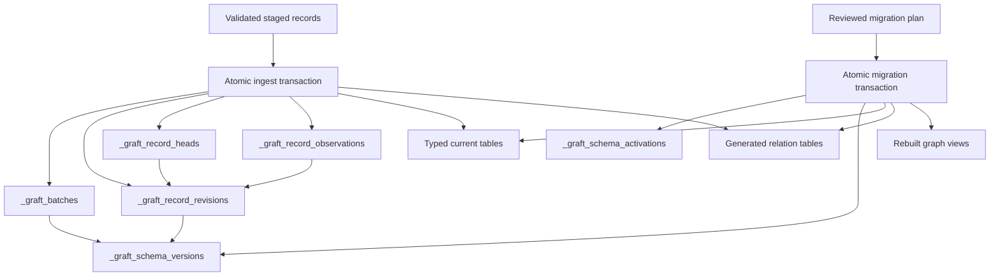

# Graft knowledge change control

## Objective

Graft should explain what it currently accepts, how that knowledge changed,
which batch caused each change, which exact schema governed it, and what it had
accepted at a particular commit boundary.

The design provides system-time history for every record. Domain-valid time
remains a separate semantic concept declared by statement schemas through
`valid_from` and `valid_to`.

## Product boundaries

This work strengthens Graft's general knowledge-store contract. It does not add
workflow-specific behavior, scheduling, document parsing, vector retrieval,
probabilistic matching, arbitrary graph queries, alternate backends, or
multi-process write coordination.

Because the package has no external users, this implementation makes a clean
store-format cutover. Stores created by earlier development versions are
rejected with a classed format error instead of being upgraded or operated in a
legacy mode.

## Architecture

Manifest-defined typed tables remain the fast current-state projection. An
append-only revision ledger becomes the audit source.

### Schema registry

`_graft_schema_versions` stores every exact compiled manifest identified by its
build digest. `_graft_schema_activations` records when a manifest became active.
The singleton store metadata records the active build and structural digests.

### Revision ledger

`_graft_record_revisions` stores one immutable row for each accepted insert or
update. Each row contains a revision ID and number, record identity and class,
batch and schema references, operation, canonical logical-record JSON, content
digest, changed fields, prior revision, recorded time, and commit order.

`_graft_record_heads` points each record to its current revision. Existing batch
and observation metadata records the schema build, disposition, revision, and
deterministic commit order.

Canonical payloads contain scalar and multivalued fields after normalization.
Ordered collections preserve order and unordered collections sort their
canonical values. System-managed timestamps are preserved in payloads but are
excluded from content digests and changed-field calculations.

### Temporal semantics

- Record IDs never change class.
- Revision rows are append-only.
- Inserts and updates create one revision in the same transaction as current
  state.
- Matches create an observation pointing at the current revision.
- Idempotency replays create no new metadata.
- Failed batches leave no partial current state or history.
- Commit order, rather than clock precision alone, determines transaction order.
- `as_of` means the state committed by Graft at that boundary.
- Statement validity remains distinct from transaction history.
- Historical public retrieval applies the historical manifest's sensitivity
  rules.
- Direct writes to client tables are unsupported and integrity checks report
  divergence from the revision heads.

### Schema migrations

Schema changes are classified as `compatible`, `additive`, `review_required`,
`destructive`, or `unsupported`. Migration plans are declarative, deterministic,
and bound to the store ID, format, and active schema digest used to create them.

The first migration implementation applies only:

- New optional concrete classes and tables.
- New optional scalar slots.
- New generated multivalue relation tables.
- New enum permissible values.
- Required graph-view rebuilds.

It reports but refuses removals, renames, type changes, required fields,
identifier-policy changes, normalization changes, cardinality changes, enum
removals, sensitivity changes, semantic predicate changes, custom R functions,
and raw SQL. There is no force flag.

Applying a plan rechecks its preconditions, drops dependent generated views,
applies DDL, registers and activates the new manifest, recreates views, verifies
the physical catalog, and records the migration in one transaction.

## Public surface

- `kg_store_info()` reports format, history, and active-schema information.
- `kg_batches()` returns bounded batch provenance.
- `kg_history()` returns bounded revisions for one record and hydrates its
  accepted state at a committed batch or time boundary.
- `kg_changes()` returns bounded changes by batch, record, class, or time.
- `kg_plan_migration()` creates a deterministic, tamper-evident migration plan.
- `kg_apply_migration()` explicitly applies a reviewed plan.

No agent tool is added until its underlying R interface is stable, bounded, and
safe for sensitive fields.

## Implementation checklist

### Store-format and revision foundation

- [x] Cut the store format to version 2 and reject other formats explicitly.
- [x] Add schema version and activation metadata.
- [x] Add record revision and head metadata.
- [x] Add batch schema and commit-order metadata.
- [x] Add observation disposition and revision metadata.
- [x] Register the initial manifest during store creation.
- [x] Create deterministic canonical logical-record payloads and content
  digests.
- [x] Capture revisions and update heads within `kg_ingest()` transactions.
- [x] Preserve match, replay, rollback, identity, and relation behavior.

### History retrieval and integrity

- [x] Expose bounded batch provenance.
- [x] Expose bounded record history.
- [x] Expose bounded changes with manifest-governed sensitivity filtering.
- [x] Add point-in-time hydration for one record.
- [x] Add shallow and deep store integrity diagnostics.
- [x] Expose history and schema capabilities through store metadata.

### Schema migration

- [x] Enrich schema diffs with deterministic per-change classification.
- [x] Create deterministic, tamper-evident migration plans with store
  preconditions and digests.
- [x] Apply supported additive DDL atomically.
- [x] Register schema activation and migration history.
- [x] Recreate and verify generated graph views.
- [x] Refuse stale, read-only, destructive, and unsupported plans before
  mutation.

### Documentation and release quality

- [x] Document every public function and add it to the pkgdown reference index.
- [x] Add user-facing changes to `NEWS.md`.
- [x] Add a runnable history and migration example.
- [x] Add tests for new stores, revisions, matches, replays, rollbacks,
  multivalues, sensitivity, deterministic ordering, additive migrations,
  migration drift, read-only behavior, and unsupported changes.
- [x] Run `air format .`, focused tests, the complete test suite,
  `pkgdown::check_pkgdown()`, and `devtools::check()`.
- [x] Conduct an adversarial code and test review before creating the pull
  request.

## Deferred work

- Destructive or custom-transform migrations.
- Historical graph traversal and external-identifier lookup.
- Merge and split adjudication.
- User-facing deletion, retention, or selective history purging.
- Vector or hybrid retrieval.
- Alternate backends and multi-process writers.
- A history inspector UI.

## Code references

| Component | File | Key symbols |
|---|---|---|
| Ingestion | `R/ingest.R` | `kg_ingest()`, `write_staged_records()`, `write_staged_lineage()` |
| Normalization | `R/validation.R` | `prepare_ingest_records()`, `normalize_class_records()`, `record_has_changes()` |
| Identity | `R/identity.R` | `resolve_record_identity()` |
| Store metadata | `R/metadata.R` | `metadata_table_definitions()`, `verify_initialized_store()` |
| Store lifecycle | `R/store.R` | `kg_init()`, `kg_store_info()` |
| Schema comparison | `R/schema-diff.R` | `kg_schema_diff()` |
| History and integrity | `R/history.R` | `kg_batches()`, `kg_changes()`, `kg_history()`, `kg_check_store()` |
| Schema migration | `R/migration.R` | `kg_plan_migration()`, `kg_apply_migration()` |
| Typed DDL | `R/ddl.R` | `create_manifest_tables()`, `create_table()` |
| Record retrieval | `R/records.R` | `kg_records()`, `kg_get()`, `kg_lookup()` |
| Claims and evidence | `R/claims.R` | `kg_claims()`, `kg_evidence()` |
| Graph views | `R/graph-projection.R` | `create_graph_views()` |
| Core contract | `inst/schema/graft-core.linkml.yaml` | `GraftRecord`, `GraftStatement` |
