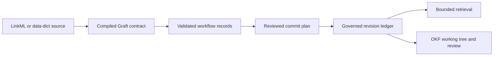

# Graft v0.1 redesign

Status: Implemented

This decision defines the pre-production redesign of Graft. It supersedes the
typed-current-table and physical-migration decisions in
`design/knowledge-change-control.md`. That document remains a description of
the current implementation until this plan is complete.

## Decision summary

Graft will keep one authoritative representation of accepted record content:
the append-only revision ledger. Current records, class-shaped tables, graph
edges, search data, and other indexes will be derived from that ledger and may
be rebuilt without losing knowledge.

Writes will use one staged plan/commit contract. Planning will normalize and
validate records, resolve identity, compare current heads, and produce a
tamper-evident change set without writing. Committing will recheck the plan's
preconditions and append its accepted changes atomically. Direct ingestion and
OKF review will use this same contract.

The implementation will use S7 for a small set of invariant-rich package
objects. A compiled `.graft.json` manifest remains the runtime domain type
system, with LinkML or data-dict as alternative source-contract providers.
Data frames remain the bulk record boundary, and DuckDB remains the only
storage backend.

## Product boundary

The redesign retains Graft's core product flow:

Graft owns the compiled semantic contract, stable identity, validation,
accepted record history, provenance, and bounded retrieval. A source
description comes from LinkML or data-dict; neither provider is the accepted
ledger or an independent mutation path. Host applications own workflow
orchestration, scheduling, model selection, approval presentation, and
consequential actions. OKF is the readable working surface; it is not an
independent source of accepted knowledge.

The strict data-dict provider publishes sanitized contract metadata, not a
copy of the full resolved export. Column examples and ranges, dataset origin,
table origins, and table source locators remain bound into source and build
digests but are not present in cleartext. The digests permit equality tests and
offline guessing of low-entropy values, so they are provenance bindings rather
than a secrecy mechanism. Other retained metadata is public and can contain
observed or sensitive values embedded manually. YAML
source-spec version, resolved JSON export-format version, and guarded CLI
provenance remain distinct. One captured source-byte snapshot feeds YAML
preflight, CLI export, and the source/build fingerprints. Exact-value and
temporal boundaries fail closed: numeric identifier types and unsafe JSON
numeric tokens are rejected before lossy conversion, while supported datetime
zone forms are enforced during planning.

## Authoritative storage

### Durable facts

The new store format will persist:

- Immutable record revisions containing canonical logical-record payloads.
- Immutable batch, observation, schema, and identity-decision metadata needed
  to explain why each revision was accepted.
- Deterministic commit ordering and links between revisions.

`_graft_record_revisions` is the authority for record content. A record head is
a rebuildable pointer to the latest accepted revision, not a second copy of the
record. If heads remain materialized for performance, Graft must be able to
reconstruct and verify them from revision order.

### Derived state

Class-shaped current views will project the active head payloads through the
active compiled Graft contract. Multivalued relations, graph edges, search
rows, and other performance indexes will also be generated projections. The
source provider controls which semantics reach that compiled contract: scalar
data-dict foreign keys validate targets but do not become graph traversal
edges. Projections may be SQL views, transactionally maintained tables, or
versioned caches, provided that:

- They never become an independent write surface.
- Their freshness is explicit and checked before use.
- They can be dropped and rebuilt from durable facts.
- A projection failure cannot be reported as a failed authoritative commit
  after the commit has succeeded.

The current manifest-defined physical record tables and generated relation
tables will be removed. Integrity checks will validate the revision chain,
schema references, identity decisions, and projection freshness instead of
comparing two authoritative copies of current content.

## Plan and commit contract

`graft_plan()` will be the only path from untrusted input to a candidate change
set. It is read-only and deterministic for the same store snapshot, schema,
records, and provenance. A plan will contain at least:

- The store ID, store-format version, and active schema digest.
- Canonical records and their source-row coordinates.
- Provenance and idempotency identity.
- Resolved record IDs and the evidence for each identity decision.
- Expected current revision IDs and content digests.
- Insert, update, and match dispositions with changed fields.
- All validation issues that can safely be collected in one pass.
- A deterministic plan digest.

`graft_commit()` will accept only a valid `GraftCommitPlan`. Before mutation it
will recheck the store identity and format, schema digest, plan digest,
idempotency state, write capability, and expected record heads. A stale or
tampered plan will fail with a classed condition and no writes.

The commit transaction will bulk append the batch, identity decisions,
revisions, heads, and observations. A replay of a committed idempotency key will
return the original result without new metadata. Any failure before transaction
commit will leave no partial accepted state.

`graft_ingest()` will be the convenience path that plans and immediately
commits when the plan is valid. OKF imports will produce an ordinary commit plan
and use the same commit operation after review. They will not maintain a second
validation or mutation pipeline.

## Set-based ingestion

Planning and committing will stage normalized input in temporary DuckDB tables
or registered relations. Identity lookup, current-head lookup, disposition
calculation, reference validation, and writes will use set-based joins and bulk
operations.

Database calls must not occur inside a loop over input records. Database
statement counts may vary by class or bounded chunk, but not linearly with row
count. R-level iteration may remain where it expresses schema-level
normalization and does not cause row-by-row database traffic.

The implementation will keep the existing semantic guarantees: stable
identity, class consistency, relationship validation, deterministic
canonicalization, atomic batches, exact revision history, and idempotent
replays.

## Targeted S7 model

S7 will move from `Suggests` to `Imports`, and the minimum R version will move
to R 4.3 or newer so package code can use the property interface consistently.
S7 will define and validate these stable semantic objects:

| Object | Responsibility |
|---|---|
| `GraftSchema` | Owns a validated compiled contract and its digests. |
| `ClassContract` | Internal normalized contract for one concrete class. |
| `SlotContract` | Internal normalized field and relation contract. |
| `GraftProvenance` | Carries producer, run, idempotency, and metadata identity. |
| `GraftCommitPlan` | Carries the immutable reviewed change set and preconditions. |
| `GraftStore` | Owns store identity and a private environment containing connection state. |

Properties and class validators will enforce invariants at construction.
Methods will express behavior only where dispatch clarifies a real semantic
operation. Results that are naturally tabular will remain data frames, and
simple summaries need not become S7 objects.

## Public API

The target public surface is intentionally small. Names below are the v0.1
contract; additions require a demonstrated user workflow rather than exposing
an internal layer.

| Concern | Public functions |
|---|---|
| Contract | `graft_schema()` |
| Store lifecycle | `graft_open()`, `graft_close()` |
| Changes | `graft_plan()`, `graft_commit()`, `graft_ingest()` |
| Retrieval | `graft_get()`, `graft_find()`, `graft_query()` |
| History | `graft_history()` |
| Open knowledge | `graft_sync()`, `graft_status()`, `graft_review()` |
| Agents | `graft_tools()` |

`graft_query()` will provide the bounded advanced retrieval surface rather than
exporting separate functions for each internal projection. Schema inspection
will be available through `GraftSchema` properties or one returned summary,
not a family of independent exports. Agent tools will remain read-only and will
be generated from, or delegate directly to, the same bounded retrieval
operations.

The old `kg_*` API will be removed before v0.1 rather than deprecated. Empty
options such as the current single-value ingestion mode and validation level
will not be carried forward.

## Examples and integrations

The Continuous Intelligence, Materials Market Radar, and Coworker applications
will move to a companion examples repository or package. Core Graft will retain
one compact, provider-free example that demonstrates contract, plan, commit,
query, history, and OKF review.

Tempest-specific mapping belongs in Tempest or in the host application. The
exported Tempest ingestion wrapper and the unsupported artifact-store adapter
will be removed. Graft will accept ordinary records plus `GraftProvenance`; it
will not acquire workflow-specific persistence APIs.

## Schema evolution

The physical schema-migration subsystem will not be ported. The active semantic
contract may change by registering a new schema version, verifying that current
revisions can be interpreted under it, and rebuilding derived projections.
Historical revisions retain their exact schema digest.

Changes that require transforming authoritative payloads are deferred. During
v0.1 development, users will rebuild a store from source records under the new
contract. There will be no force flag and no hidden in-place transformation.

## Compatibility stance

This is a deliberate pre-production cutover:

- The new architecture will use a new store-format version and reject earlier
  development stores with a classed error.
- Existing fixtures will be recreated; no store migration will be written.
- Existing exported function names, arguments, return classes, and serialized
  objects do not need compatibility shims.
- Documentation and tests will describe only the v0.1 contract when the
  redesign merges.

Temporary internal adapters are acceptable while the branch is under
development, but they must not remain in the released package.

## Non-goals

- Dynamic S7 classes for each source domain class or table.
- A multi-backend abstraction without a second implemented backend.
- Preserving compatibility with existing store formats or exported APIs.
- Destructive or custom-transform schema migration.
- Workflow orchestration, scheduling, approval UI, or model-provider behavior.
- Vector retrieval, probabilistic identity matching, arbitrary graph queries,
  or multi-process write coordination.

## Acceptance criteria

The redesign is complete only when all of the following are true:

- Accepted record content has one authoritative persisted representation.
- Current class views and indexes can be removed and rebuilt without losing
  record content, identity, provenance, or history.
- Planning performs no persistent writes and returns all safely collectable
  validation issues with source-row coordinates.
- Committing rejects stale, tampered, cross-store, cross-schema, read-only, and
  invalid plans before mutation.
- Insert, update, match, replay, and rollback behavior is covered through the
  shared plan/commit path, including OKF-originated changes.
- Core planning and committing contain no per-record database query or write
  loops.
- Under the same benchmark setup, ingestion of the 1,000-record simple fixture
  is at least ten times faster than the recorded 23.34-second baseline.
- The package exports no more than 15 user-facing functions.
- S7 validators cover schema, provenance, plan, and store invariants; bulk
  records and retrieval results remain ordinary data frames where appropriate.
- The three application demonstrations and Tempest-specific public APIs are no
  longer shipped in the core package.
- The physical table migration API and implementation are removed.
- The complete test suite, `pkgdown::check_pkgdown()`, `devtools::check()`, and
  `air format .` complete without errors, warnings, or notes attributable to
  the redesign.

## Phased implementation checklist

### Phase 0: Fix the boundary

- [x] Accept this architecture decision.
- [x] Capture the current correctness tests as behavior-level requirements,
  separating durable semantics from legacy representation details.
- [x] Add a reproducible ingestion benchmark for 100 and 1,000 records.

### Phase 1: Separate the product from its demonstrations

- [x] Remove the three installable applications and their host-specific tests
  from core; relocation is independent of the package cutover.
- [x] Remove Tempest-specific exports, adapters, remotes, and documentation from
  core Graft.
- [x] Retain one provider-free core walkthrough of the complete knowledge loop.

### Phase 2: Establish the semantic model and facade

- [x] Add the targeted S7 classes, property types, validators, and tests.
- [x] Move S7 to `Imports` and raise the minimum R version.
- [x] Introduce the `graft_*` facade and route it through the new objects.
- [x] Delete the temporary `kg_*` bridge before completing the cutover.

### Phase 3: Build the revision-first store

- [x] Define the new store-format metadata and append-only durable tables.
- [x] Implement deterministic reconstruction and verification of record heads.
- [x] Generate class-shaped current views from active revisions.
- [x] Generate and rebuild relation, graph, and search projections.
- [x] Prove that dropping derived projections does not lose accepted knowledge.

### Phase 4: Implement planning

- [x] Normalize all input into a common staging relation.
- [x] Resolve identity and validate references in bulk.
- [x] Compare staged content with current revisions in bulk.
- [x] Produce deterministic `GraftCommitPlan` objects and aggregated issues.
- [x] Test read-only behavior, determinism, tamper evidence, and stale heads.

### Phase 5: Implement committing

- [x] Recheck every plan precondition before mutation.
- [x] Append batches, identity decisions, revisions, heads, and observations in
  one transaction using bulk operations.
- [x] Implement replay-safe result recovery.
- [x] Verify atomic rollback for failures at each write stage.
- [x] Meet the database-statement and performance acceptance criteria.

### Phase 6: Unify retrieval, history, and OKF

- [x] Port bounded retrieval and history to the ledger and derived views.
- [x] Route OKF edits through the shared plan and commit contract.
- [x] Generate agent tools from the shared retrieval contract.
- [x] Update integrity diagnostics for authoritative and derived state.

### Phase 7: Remove the legacy architecture

- [x] Delete manifest-defined current tables and generated relation writes.
- [x] Delete physical migration planning and application.
- [x] Remove duplicate validation, write, and retrieval paths.
- [x] Remove all remaining public compatibility shims.

### Phase 8: Document and qualify v0.1

- [x] Rewrite the README and getting-started material around contract, plan,
  commit, query, history, and review.
- [x] Rebuild fixtures under the new store format.
- [x] Run formatting, focused tests, the full test suite, package checks, and
  documentation checks.
- [x] Conduct an adversarial design, code, performance, and test review before
  merging.

## Stable code references

| Concern | Current location | Key symbols |
|---|---|---|
| Schema and store boundaries | `R/schema-store-s7.R` | `GraftSchema`, `GraftStore`, `graft_schema()`, `graft_open()` |
| Planning and validation | `R/staging.R`, `R/commit-plan.R` | `graft_plan()`, `GraftCommitPlan` |
| Atomic acceptance | `R/commit-executor.R`, `R/commit-support.R` | `graft_commit()`, `commit_candidate_transaction()` |
| Revision authority | `R/revisions.R`, `R/projections.R` | `logical_record_content_digest()`, `rebuild_store_projections()` |
| Identity resolution | `R/identity.R` | `resolve_candidate_identities()` |
| Retrieval and history | `R/graft-retrieval.R`, `R/history.R` | `graft_get()`, `graft_query()`, `graft_history()` |
| OKF review | `R/okf-import.R`, `R/okf-managed.R` | `graft_review()`, `graft_sync()`, `graft_status()` |
| Agent access | `R/agent-tools.R` | `graft_tools()` |
